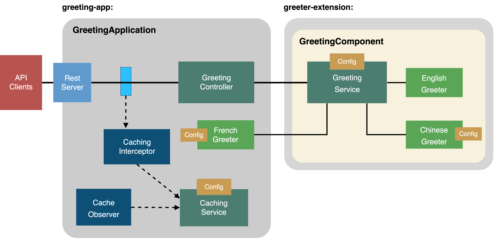
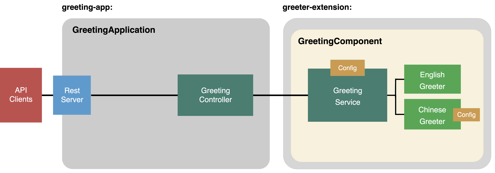
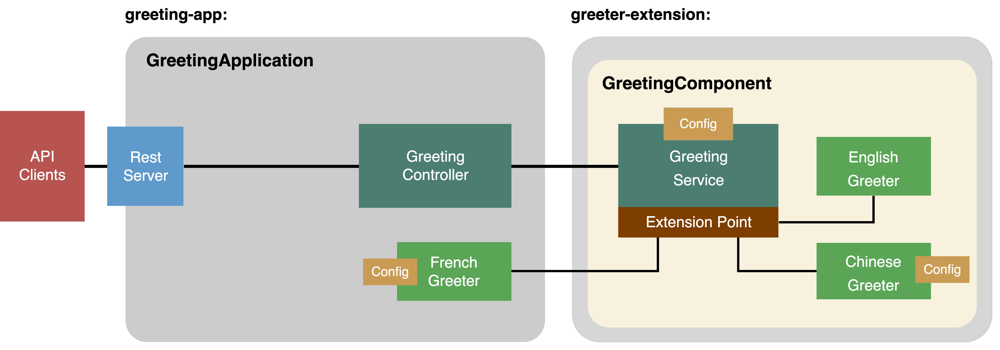
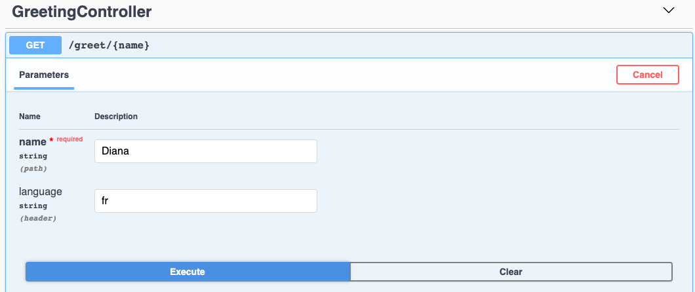

# Write scalable and extensible Node.js applications using LoopBack 4

## What is LoopBack?

[LoopBack 4](https://loopback.io/) is a popular open source API creation framework
for Node.js. Built on top of Express, it enables developers to quickly create REST and other forms of APIs to interact with backend databases, services and other infrastructure using model driven design patterns. The command line tool makes the API creation easy and productive.

Rewritten in TypeScript from ground-up, LoopBack 4 core offers an Inversion of Control container with powerful Dependency Injection capabilities as the foundation to build large-scale Node.js projects with great flexibility and extensibility.

## Target Users

- API developers
- Platform developer + Extension developer

## About This Workshop

As your Node.js application becomes more complex, how do you increase its scalability with proven design patterns and best practices? How do you follow 12-factor principles to make your application flexible, extensible and composable? Let’s run a fun workshop to create a scalable and extensible application! While we could do this from scratch, we'll get there much faster and easier using a framework that does a lot of the hard work for us.

In this workshop, you will be guided to scaffold a greeter application using the LoopBack 4 framework. We will create a simple greeting API that prints out a welcome message such as "Hello, LoopBack". Then we will improve it incrementally.

Here is a brief outline of the workshop:

1. Create a greeting endpoint that invokes service to generate the greeting message

   - how to easily create you app with LB4.

2. Package the greeting service in a separate module from the greeting app

   - good design and bad design -- how to decouple modules/services.

3. Improve the greeting API with language support based on the client's locale

   - how LB4 makes your application easily extensible and pluggable.

4. Improve the greeting API with configuration options

   - how to configure an extension that binds to a LB4 app.

5. Enable caching by sweeping for REST requests (interception/observation)

   - how to extend your application by applying interceptors and observers.



This miniature project reflects many key aspects of a scalable and extensible applications, and relevant techniques that will be covered in the workshop like: Inversion of Control, Dependency Injection, Decorators and Components.

## Before We Begin

To complete the steps in this tutorial, you need to install Node.js and the LoopBack 4 command line interface (CLI).

1. Install Node.js version 8.9 or higher.
   See the [Node documentation](https://nodejs.org/en/download/) for installation instructions.

   Tip: We recommend to use [Node Version Manager (nvm)](https://github.com/nvm-sh/nvm) to make it easier to manage the Node.js versions you're using.

2. Install LoopBack 4 CLI

   The LoopBack 4 CLI is a command-line interface that scaffolds an application as well as artifacts (for example, controllers, models, and repositories) for existing applications. The CLI provides the fastest and easiest way to get started with a LoopBack 4 project that adheres to best practices.

   Install the CLI globally by running the following command:

   ```sh
   npm i -g @loopback/cli
   ```

3. Set up development environment

   If you don't have a development environment, we'd recommend using [Visual Studio Code](https://code.visualstudio.com/). The LoopBack application generator CLI allows you to generate the VSCode setting files.

## How to use this repo and its branches

This repository contains different branches for various stages of this workshop.
The master branch only contains the instructions (README.md) for this workshop.
The `workshop-part1-completed` branch contains the instructions (README.md) for this workshop as well as all the artifacts completed in Part 1 on the workshop. The same is true for the remaining `workshop-part{2,3,4}-completed` branches.
In the workshop, you will `git clone` this repository and start adding code with the master branch.
Every time you finish a section, you can run 
```sh
git checkout <the_next_step>
``` 
to begin the next section.
For example, when following the first section, you will be on branch `master`. After the app is created, you can run 
```sh
git stash
git checkout workshop-part1-complete
```
which contains our default implementation for section 1 to begin section 2.

## Part 1: Create a Greeting Application

```sh
git checkout master
```

We are going to create a greeting application that contains a greeting service. 
We will place our application and its various artifacts in the `greeting-app` module.


Steps 1-3 show how LB4 can quickly create a greeting endpoint.

### Step 1: Scaffold a LoopBack application

One of LoopBack 4's significant features is to enable you to quickly create application and REST APIs. 

1. Scaffold a LoopBack application by running the `lb4` command.

   ```sh
   $ lb4 app
   ? Project name: greeting-app
   ? Project description: a LoopBack 4 application with a greeting service
   ? Project root directory: greeting-app
   ? Application class name: GreetingApplication
   ? Select features to enable in the project (Press <space> to select, <a> to togg
   le all, <i> to invert selection)Enable eslint, Enable prettier, Enable mocha, En
   able loopbackBuild, Enable vscode, Enable docker, Enable repositories, Enable se
   rvices
   ...
   Application greeting-app was created in greeting-app.

Next steps:

```
$ cd greeting-app
$ npm start
   ```

2. Go into the `greeting-app` directory and open Visual Studio Code
   ```sh
   cd greeting-app
   code .
   ```

### Step 2: Create a Message Type File

We're going to create a `Message` type. This will be used as the response type that the GreetingService produces. In the `src` folder, create a file called `types.ts` with the following content. 

```ts
/**
 * Greeting message response
 */
export interface Message {
  timestamp: Date;
  language: string;
  greeting: string;
}
```

### Step 3: Create a Simple Greeter Service Class

We're going to create a `SimpleGreetingService` class.

In the `src` folder, create a `folder` called `services`

In the `src/services` folder, create a `file` called `simple.greeting.service.ts` with the following content.

```ts
export class SimpleGreetingService {
    
    async greet(language: string, name: string): Promise<string> {     
      return `Greeting '${name}' in language '${language}'`;
     }
  }
```

We're not going to fully implement this greeting service at this moment.

### Step 4: Create a Greeting Controller

A Controller is a class that implements operations defined by an application’s API. It implements an application’s business logic and acts as a bridge between the HTTP/REST API and domain/database models.

1. Let's create the controller:

   ```sh
   $ lb4 controller
   ? Controller class name: Greeting
   Controller Greeting will be created in src/controllers/greeting.controller.ts

   ? What kind of controller would you like to generate? Empty Controller
   create src/controllers/greeting.controller.ts
   update src/controllers/index.ts

   Controller Greeting was created in src/controllers/
   ```

2. In the generated GreetingController in `src/controllers/greeting.controller.ts`, add the necessary imports

   ```ts
    import {SimpleGreetingService} from '../services/simple.greeting.service';
    import {param, get} from '@loopback/rest';
    import {Message} from '../types';
   ```

3. Modify the constructor:

   ```ts
    private greetingService: SimpleGreetingService;

    constructor() {
      this.greetingService = new SimpleGreetingService();
    }
   ```

4. Add the endpoint `/greet/{name}` which calls `SimpleGreetingService`.

   ```ts
    @get('/greet/{name}', {
      responses: {
      '200': {
          description: '',
          content: {
          'application/json': {
              schema: {
              type: 'object',
              properties: {
                  timestamp: 'string',
                  language: 'string',
                  message: 'string',
              },
              },
          },
          },
      },
      },
      })
    async greet(
      @param.path.string('name') name: string,
      @param.header.string('Accept-Language') language: string,
    ): Promise<Message> {
      const greeting = await this.greetingService.greet(language, name);
      return {
      timestamp: new Date(),
      language,
      greeting,
      };
   }
   ```

### Step 5: Try it Out!

Start the app.

```sh
$ npm start
Server is running at http://[::1]:3000
Try http://[::1]:3000/ping
```

Go to the [API Explorer](http://localhost:3000/explorer), you should see the `GreetingController` section as shown in the screen shot below.

Click `[Try it out]`.


If you notice on the left, the `API Explorer` is showing you that the REST API endpoint expects the `name` value in the url path, and the `language` value in the `Accept-Language` header.

#### Test 1: Set the Language to English `en`

Type in a name for the `name` field and `en` for the `language` field to indicate we're testing it using English. Then click Execute.

Under the Responses section, you should be able to see the response code of `200` and a response body similar to below:

```json
{
  "timestamp": "2019-10-25T14:41:26.587Z",
  "language": "en",
  "greeting": "Greeting 'LoopBack' in language 'en'"
}
```

This application works; we have the controller calling a greeting service.

The design approach isn't the best, though.

1. `SimpleGreetingService`'s `greet(language,name)` function would end up containing a large `switch` statement for every language we want to support; returning a different greeting for each language. We need to use a greeting service that has been designed in a more extensible fashion; using the `extensionPoint/extension` pattern for example. And this should be placed in a different module so it can be used by other applications.

2. By instantiating a specific greeting service class in a controller, we are creating a tight coupling. It is better if we use `dependency injection` in the controller's constructor.

## Part 2: Better Design

```sh
git add .
git stash
git checkout workshop-part1-completed
```

LB4 allows you to extend your application by importing other modules and binding/injecting various artifacts to meet your business requirements.

We are going to take this monolithic application and exercise a good separation of concerns by dividing responsibilities across a few artifacts. And since our main focus today is extensibility and scalability, we will utilize some pre-existing artifacts (component, interface, service, extensionPoint, extensions) from the `greeter-extension` module, and we keep our application and its various artifacts in the `greeting-app` module. Keeping common services and components in separate modules provides a good separation of concerns and using bindings/injections makes your app loosely coupled and scalable.



### Step 1: Install greeter-extension module

We'll be using several artifacts from the` @loopback/example-greeter-extension` module in our application.

**Stop the app with Ctrl+C**

**Delete** `src/services/simple.greeting.service.ts` (We don't need it anymore)

Install the module:
 
   ```sh
   cd greeter-app
   npm i
   npm i --save @loopback/example-greeter-extension
   ```

### Step 2: Modify the Greeting Controller by Injecting the GreetingService

Let's modify `greeting-app/src/controllers/greeting.controller.ts`

1. **Remove** the old import statements

2. Add the new imports

   ```ts
   import {param, get, Request, RestBindings} from '@loopback/rest';
   import {Message} from '../types';
   import {inject} from '@loopback/context';
   import {
     GreetingService,
     GREETING_SERVICE,
   } from '@loopback/example-greeter-extension';
   ```

3. **Remove** the line 

    ```ts
    private greetingService: SimpleGreetingService;
    ```

4. Modify the constructor:

   ```ts   
     constructor(
       @inject(GREETING_SERVICE) private greetingService: GreetingService,
     ) {}
   ```

   The `GreetingService` class is available to us from the `greeter-extension` module via a **binding key** named `GREETING_SERVICE`. We will **inject** the greeting service into the field  `private greetingService: GreetingService`.

    A binding links a `key` to a `value` in a given context.

    ```ts
    ctx.bind('hello').to('world'); // BindingKey='hello', BindingValue='world'`
    ```


### Step 3: Bind the GreetingComponent to the application

In `src/application.ts`, 

Add the following import statement:

```ts
import {GreetingComponent} from '@loopback/example-greeter-extension';
```

Add the following line inside the constructor:

```ts
this.component(RestExplorerComponent);

// add this line. It binds the greeting component (and all its artifacts) to the app
this.component(GreetingComponent);

this.projectRoot = __dirname;
```

**What is happening here exactly?**

If we look at the definition of the `GreetingComponent` by right-clicking on it and selecting `Go to Definition`, we can see that
it contains bindings for the artifacts : `GreetingService`, `EnglishGreeter`, and `ChineseGreeter`.

```ts
export class GreetingComponent implements Component {
  bindings = [
    createBindingFromClass(GreetingService, {
      key: GREETING_SERVICE,
    }),
    createBindingFromClass(EnglishGreeter),
    createBindingFromClass(ChineseGreeter),
  ];
}
```

So, in `src/application.ts`, this line of code

```ts
this.component(GreetingComponent);
```

essentially makes these classes available to us via binding keys.

### Step 4: Try it Out!

Start the app.

```sh
$ npm start
Server is running at http://[::1]:3000
Try http://[::1]:3000/ping
```

Go to the [API Explorer](http://localhost:3000/explorer), you should see the `GreetingController` section as shown in the screen shot below. Then click "Try it out".


#### Test 1: Set the Language to English `en`

Type in a name for the `name` field and `en` for the `language` field to indicate we're testing it using English. Then click Execute.

Under the Responses section, you should be able to see the response code of `200` and a response body similar to below:

```json
{
  "timestamp": "2019-10-25T15:53:23.748Z",
  "language": "en",
  "greeting": "Hello, LoopBack!"
}
```

#### Test 2: Set the Language to Chinese `zh`

Now, change the `language` field to `zh` so that we'll setting it using Chinese.

Click Execute, and you'll get a response similar to below:

```json
{
  "timestamp": "2019-10-25T15:54:15.648Z",
  "language": "zh",
  "greeting": "LoopBack，你好！"
}
```

#### Test 3: Set the Language to French `fr`

Let's try it one more time with the language set to `fr`. The greeting service falls back to use English if it cannot find the greeter for a particular language. Therefore, if we try language `fr`, the response will be as follows:

```json
{
  "timestamp": "2019-10-25T15:55:04.512Z",
  "language": "fr",
  "greeting": "Hello, LoopBack!"
}
```

## Part 3: Add a French Greeter

```sh
git add .
git stash
git checkout workshop-part2-completed
cd greeter-app
npm i
```

 LB4 allows you to implement features that utilize the [extension points/extensions](https://loopback.io/doc/en/lb4/Extension-point-and-extensions.html) design pattern, which organizes artifacts with loose coupling and promotes extensibility. We have shown in previous steps that our app is organized into two modules. The `greeting-extension` module defines a `GreetingComponent`. `GreetingComponent` contains `GreetingService` which declares an extension point named `greeters`. There are 2 greeters (`EnglishGreeter` and `ChineseGreeter` which implement the `Greeter` interface, and which register themselves as extensions to this extension point `greeters`. `GreetingService` looks for extensions that can handle a particular language. If it cannot find the greeter for a particular language, it defaults to English. 

 

We'd like to have our app to greet to users in French! Let's create a new `FrenchGreeter` greeter class which extends [Greeter interface](https://github.com/strongloop/loopback-next/blob/master/examples/greeter-extension/src/types.ts#L13), and registers itself as an extension of extension point [`greeters`](https://github.com/strongloop/loopback-next/blob/master/examples/greeter-extension/src/types.ts#L21) declared by [`GreetingService`](https://github.com/strongloop/loopback-next/blob/master/examples/greeter-extension/src/greeting-service.ts#L22).


### Step 1: Create a French Greeter

**Stop the app with Ctrl+C**

1. In `src` folder, create a file called `greeter-fr.ts`.
2. Add the required imports.

   ```ts
   import {bind, config} from '@loopback/context';
   import {asGreeter, Greeter} from '@loopback/example-greeter-extension';
   ```

3. Add the `FrenchGreeterOptions` interface.
   This will be added to `FrenchGreeter` class.
   ```ts
   /**
    * Options for the Frech greeter
    */
   export interface FrenchGreeterOptions {
     // Name first, default to `true`
     nameFirst: boolean;
   }
   ```

   This part allows you to configure the extension. We will talk about configuration later. 

4. Add the `FrenchGreeter` class.

   ```ts
   /**
    * A greeter implementation for French.
    */
   @bind(asGreeter)
   export class FrenchGreeter implements Greeter {
     // By checking the value of property language, the extension point matches a greeter to the language set from a request.
     language = 'fr';

     constructor(
       /**
        * Inject the configuration for FrenchGreeter
        */
       // we inject the configuration we just defined here with `@config` decorator. We will talk about configuration later. 
       @config()
       private options: FrenchGreeterOptions = {nameFirst: true},
     ) {}

     greet(name: string) {
       if (this.options && this.options.nameFirst === false) {
         return `Bonjour，${name}！`;
       }
       return `${name}, Bonjour`;
     }
   }
   ```

### Step 2: Bind the FrenchGreeter in the Application

In `src/application.ts`, 

Add the following import statements:

```ts
import {ApplicationConfig, createBindingFromClass} from '@loopback/core'; //Change this line
import {FrenchGreeter} from './greeter-fr'; //Add this line
```

Inside the constructor, add the line below:

```ts
this.component(GreetingComponent);
// this line plugs in the extension
this.add(createBindingFromClass(FrenchGreeter));
```

By adding the `FrenchGreeter` extension, the french language becomes available to the `GreetingService`.

### Step 3: Try Out the New Greeter

Let's try out the new French Greeter.

1. Start the application again by running `npm start`.
2. Go to API Explorer, http://localhost:3000/explorer.
3. Under the `GET /greet/{name}` endpoint, enter `fr` as the language as shown below.

   

4. In the response body section, you should be able to see the greeting in French.
   ```json
   {
     "timestamp": "2019-10-01T18:47:37.096Z",
     "language": "fr",
     "greeting": "Diana, Bonjour"
   }
   ```

### Step 4: Configure the Chinese Greeter

Besides enabling you to bind various types of classes to a binding key on a context, LB4 also allows you to `configure` bound items easily. Such configurations can be resolved and injected in the same way as other dependencies.

The default setting in `ChineseGreeter` is to say your `name` first, followed by  `你好` (hello). For example `LoopBack, 你好`. Let's `configure` the `ChineseGreeter` to say `你好` followed by your `name`.

Add this line in your `application.ts` file

```ts
this.component(GreetingComponent);
this.add(createBindingFromClass(FrenchGreeter));

// Add the following line
this.configure('greeters.ChineseGreeter').to({nameFirst: false});
```

### Step 5: Try it Out!

Restart your application, try endpoint `GET /greeting/{name}`, with `language` set to `zh`.

You will see message `'你好, name'` printed instead of `'name, 你好'`.

Related documentation:
[Configuration by convention](https://loopback.io/doc/en/lb4/Context.html#configuration-by-convention)

## Part 4: Enable Caching

```sh
git add .
git stash
git checkout workshop-part3-completed
cd greeter-app
npm i
```

To reduce the cost of calculation, we'd like to add a caching system for the greeting application. We will show how to bind a caching service, interceptor and observer to the app.

Here are the requirements:

- Cache the result using the request's uri and language as the key.
- The cached message has an expiration time.
- Expired messages will be swept out periodically.


Again, we are using `bind` and `injection` to bind our app with an Interceptor and Observer:

- Interceptors: are reusable functions that provide [aspect-oriented](https://en.wikipedia.org/wiki/Aspect-oriented_programming) logic around method invocations.
- Observer: is a LoopBack application that has its own life cycles at runtime. An [`Observer allows`](https://loopback.io/doc/en/lb4/Life-cycle.html#the-lifecycleobserver-interface) artifacts to participate in the life cycles. The transition of states is triggered by two functions: `start()` and `stop()`.

### Step 1: Create a caching service

**Stop the app with Ctrl+C**

1. Copy the contents of [caching.service.ts](https://github.com/strongloop/cascon2019/blob/workshop-part4-completed/greeting-app/src/services/caching.service.ts) to a new file in your workspace named `src/services/caching.service.ts`.

2. Create the binding key for caching service.

    Let's create the binding key for the caching service so that you can inject it in an observer or an interceptor later.

    In `src` folder, create a file called `keys.ts` with the following content:

    ```ts
    import {BindingKey} from '@loopback/context';
    import {CachingService} from './services/caching.service';

    /**
     * Strongly-typed binding key for CachingService
    */
    export const CACHING_SERVICE = BindingKey.create<CachingService>(
    'services.CachingService',
    );
    ```

### Step 2: Create global interceptor for caching

1. Run the interceptor generator `lb4 interceptor` command.

   ```sh
   $ lb4 interceptor
   ? Interceptor name: caching
   ? Is it a global interceptor? Yes

   Global interceptors are sorted by the order of an array of group names bound to ContextBindings.GLOBAL_INTERCEPTOR_ORDERED_GROUPS. See https://loopback.io/doc/en/lb4/Interceptors.html#order-of-invocation-for-interceptors.

   ? Group name for the global interceptor: ('')
   create src/interceptors/caching.interceptor.ts
   update src/interceptors/index.ts

   Interceptor Caching was created in src/interceptors/
   ```

2. In `src/interceptors/caching.interceptors.ts`

      Add and modify the following import statements:

      ```ts
      import {
        /* inject, */
        globalInterceptor,
        Interceptor,
        InvocationContext,
        InvocationResult,
        Provider,
        inject,
        ValueOrPromise,
      } from '@loopback/context';
      import {CachingService} from '../services/caching.service';
      import {CACHING_SERVICE} from '../keys';
      import {RestBindings} from '@loopback/rest';
      ```
      Modify the constructor:

      ```ts
        constructor(
            @inject(CACHING_SERVICE) private cachingService: CachingService,
        ) {}
      ```

   
3. Add the pre-invocation and post-invocation logic in the `intercept` function.

   ```ts
    //we need to exclude two endpoints for the interceptor:
    const EXCLUDED_PATHS = ['/explorer/', '/explorer/openapi.json'];
    // And then skip them in the intercept function
    //Otherwise when hit the explorer endpoint, it's response also get cached but no timestamp in it, which breaks the cache interceptor.
    // Add pre-invocation logic here
    const httpReq = await invocationCtx.get(RestBindings.Http.REQUEST, {
      optional: true,
    });
    /* istanbul ignore if */
    // A workaround to skip the explorer
    if (!httpReq || EXCLUDED_PATHS.includes(httpReq.path)) {
      return next();
    }
    const path = httpReq.path;

    const lang = httpReq.headers['accept-language'] || 'en';
    const cachingKey = `${lang}:${path}`;
    const cachedResult = await this.cachingService.get(cachingKey);
    if (cachedResult) {
      console.error('Cache found for %s %j', cachingKey, cachedResult);
      return cachedResult;
    }

    const result = await next();

    // Add post-invocation logic here
    await this.cachingService.set(cachingKey, result);
    return result;
   ```

4. Then bind the Interceptor to your app in `src/application.ts` file.

   Add these imports: 

   ```ts
   // add these imports
   import {CachingService} from './services/caching.service';
   import {CACHING_SERVICE} from './keys';
   import {CachingInterceptor} from './interceptors';
   ```

   Add these lines: 

   ```ts
   this.bind(RestExplorerBindings.CONFIG).to({
     path: '/explorer',
   });
   // also add these lines. it binds interceptor and service to app
   this.add(createBindingFromClass(CachingService, {key: CACHING_SERVICE}));
   this.add(createBindingFromClass(CachingInterceptor));

   this.component(RestExplorerComponent);
   this.component(GreetingComponent);
   ```
   
   NOTE: The Observer is picked up during the `boot` process, and doesn't need to be bound to the application like other artifacts.

### Step 3: Create the observer

We'd like to start the caching service during the start of the application. Likewise, we'd also want to stop the caching service when the application stops. To do this, we are going to use a [lifecycle observer](https://loopback.io/doc/en/lb4/Life-cycle.html).

1. Run the observer generator `lb4 observer` command.

   ```sh
   $ lb4 observer
   ? Observer name: Cache
   ? Observer group: caching
   create src/observers/cache.observer.ts
   update src/observers/index.ts

   Observer Cache was created in src/observers/
   ```

2. Go to `src/observers/cache.observer.ts`,

    Add the following import statements:

      ```ts
      import {inject} from '@loopback/context';
      import {CachingService} from '../services/caching.service';
      import {CACHING_SERVICE} from '../keys';
      import {
        /* inject, Application, CoreBindings, */
        lifeCycleObserver, // The decorator
        LifeCycleObserver, // The interface
      } from '@loopback/core';
      ```

    Modify the constructor to get the caching service:

      ```ts
      constructor(
          @inject(CACHING_SERVICE) private cachingService: CachingService,
      ) {}
      ```

  
3. For the `start()` and `stop()` function, we want to start and stop the caching service.

   ```ts
   /**
    * This method will be invoked when the application starts
    */
   async start(): Promise<void> {
       // Add your logic for start
       await this.cachingService.start();
   }

   /**
    * This method will be invoked when the application stops
    */
   async stop(): Promise<void> {
       // Add your logic for stop
       await this.cachingService.stop();
   }
   ```

### Step 4: Try it out again!

Let's try it out to see the caching service, the observer, and the interceptor that we just added to the application.

Restart the application.

#### Test cache

The expire time for each result is set to 10 seconds (10000 milliseconds by default).

To test the cached result and its expiration, you can

Try `GET/ greet/{name}` with a name 'loopback' and language 'en'
You will see a result object with a timestamp field like

```
{
  "timestamp": "2019-10-09T20:24:00.294Z",
  "language": "en",
  "greeting": "Hello, loopback!"
}
```

Try the same endpoint and same input immediately (before the cached result expires). You will see the same timestamp printed in the result, which infers that the result is NOT calculated again, but came from the cache.

Wait for 10 seconds and try same endpoint again. You will see the timestamp changes (this is because the caching service swept out the entry)

```
{
// please note the time here changes
"timestamp": "2019-10-09T20:30:29.770Z",
"language": "en",
"greeting": "Hello, loopback!"
}
```

#### Test sweep

The sweep interval is set to 10 seconds (10,000 milliseconds) too.
Since the cache sweep runs every 10 seconds in the background, we can observe that the sweep function gets executed by turning on the debug string and restarting the app.

To test the cache sweeping, you can:

```
// exit your app
ctrl + c
// start it again with debug
DEBUG=greeter-extension npm run start
```

Watch the console window to see how the sweeping function is triggered every 10s

```
greeter-extension Sweeping cache... +10s
greeter-extension Sweeping cache... +10s
greeter-extension Sweeping cache... +10s
greeter-extension Sweeping cache... +10s
greeter-extension Sweeping cache... +10s
```

Try endpoint GET /greet/{name} again from explorer, see its result
Go back to the console window, after 10s, you will see the cached result gets swept

```
Cache for en:/greet/loopback is swept.
```

The interceptor, service and observer could be contributed by from different modules, or packaged together as a component, all depends on your choice. You just bind them to the app without modifying the business logic of your endpoint.

## Conclusion

Congratulations! You have completed the tutorial. You can checkout branch `workshop-part4-complete` to view the finished app.

```sh
git checkout workshop-part4-completed
```

First, you built a LoopBack application using a component GreetingComponent located in a different module named greeter-extension. Then you extended the functionality to the GreetingComponent by adding FrenchGreeter as an extension. Then you created a caching service that is started and stopped by a lifecycle observer. And lastly, you retrieved/stored request responses from/in the cache by using an interceptor.

## Authors

- [Diana Lau](https://github.com/dhmlau)
- [Janny Hou](https://github.com/jannyhou)
- [Dominique Emond](https://github.com/emonddr)
- [Agnes Lin](https://github.com/agnes512)

## References

- LoopBack documentation, https://loopback.io/doc/en/lb4/
- StrongLoop blog, https://strongloop.com/strongblog/
- LoopBack 4 GitHub repo, https://github.com/strongloop/loopback-next

## Stay in Touch

- [Twitter @StrongLoop](https://twitter.com/strongloop)
- [LinkedIn StrongLoop Developer Community Group](https://www.linkedin.com/groups/5046525)
- [Facebook @Strongloop](https://www.facebook.com/strongloop/)

[-@2x.png>)](http://loopback.io/)
