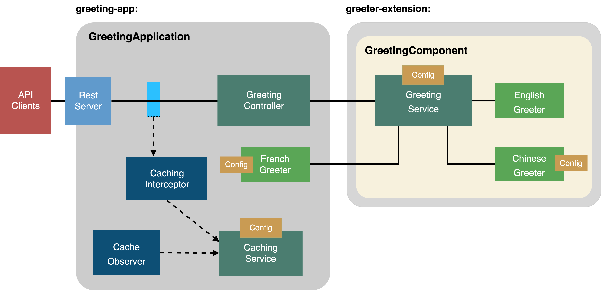
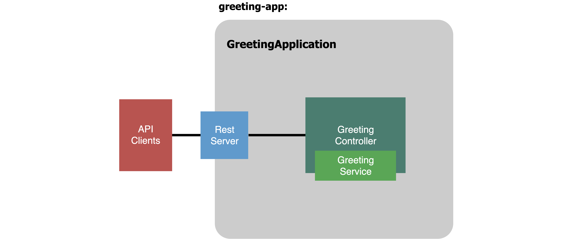
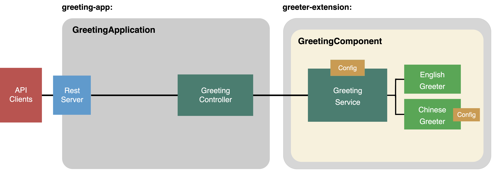
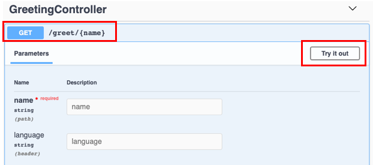
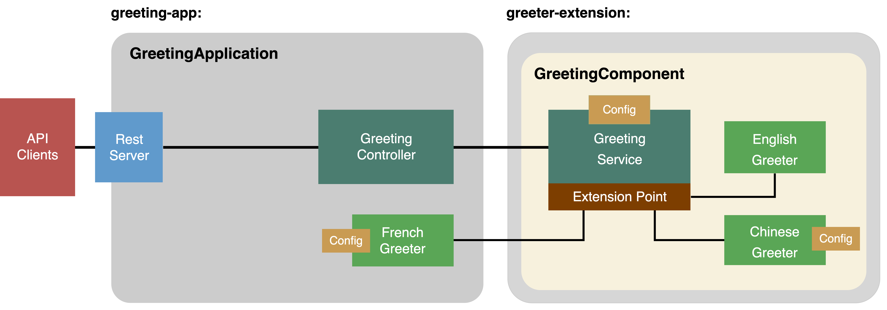
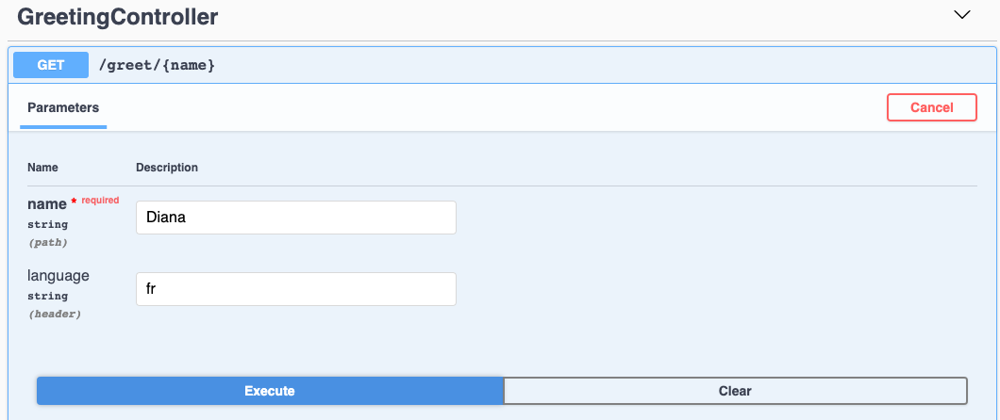

# Write scalable and extensible Node.js applications using LoopBack 4

## What is LoopBack?

[LoopBack](https://loopback.io/) is a popular open source API and a microservice framework
in Node.js. Built on top of Express, it enables developers to quickly create REST and other forms of APIs or microservices to interact with backend databases, services and other infrastructure using model driven design patterns. The command line tool makes the API creation easy and productive.

Rewritten in TypeScript from ground-up, LoopBack 4 core offers an Inversion of Control container with powerful Dependency Injection capabilities as the foundation to build large-scale Node.js projects with great flexibility and extensibility. LoopBack also integrates with cloud native health, metrics, and tracing to facilitate development of microservices for cloud deployment.

## Target Users

- API developers
- Platform developer + Extension developer

## About This Workshop

As your Node.js application becomes more complex, how do you increase its scalability with proven design patterns and best practices? How do you follow 12-factor principles to make your application flexible, extensible and composable? Let’s run a fun workshop to create a scalable and extensible application! While we could do this from scratch, we'll get there much faster and easier using a framework that does a lot of the hard work for us.

In this workshop, you will be guided to scaffold a greeter application using the LoopBack 4 framework. We will create a simple greeting API that prints out a welcome message such as "Hello, LoopBack". Then we will improve it incrementally.

Here is a brief outline of the workshop:

1. Create a greeting endpoint that invokes service to generate the greeting message

   - how to easily create you app with LB4.

2. Package the greeting service in a separate module from the greeting app

   - good design and bad design -- how to decouple modules/services.

3. Improve the greeting API with language support based on the client's locale

   - how LB4 makes your application easily extensible and pluggable.

4. Improve the greeting API with configuration options

   - how to configure an extension that binds to a LB4 app.

5. Enable caching by sweeping for REST requests (interception/observation)

   - how to bind more services to you app and make it work as a whole.



This miniature project reflects many key aspects of a scalable and extensible applications, and relevant techniques that will be covered in the workshop like: Inversion of Control, Dependency Injection, Decorators and Components.

## Before We Begin

To complete the steps in this tutorial, you need to install Node.js and the LoopBack 4 command line interface (CLI).

1. Install Node.js version 8.9 or higher.
   See the [Node documentation](https://nodejs.org/en/download/) for installation instructions.

   Tip: We recommend to use [Node Version Manager (nvm)](https://github.com/nvm-sh/nvm) to make it easier to manage the Node.js versions you're using.

2. Install LoopBack 4 CLI

   The LoopBack 4 CLI is a command-line interface that scaffolds an application as well as artifacts (for example, controllers, models, and repositories) for existing applications. The CLI provides the fastest and easiest way to get started with a LoopBack 4 project that adheres to best practices.

   Install the CLI globally by running the following command:

   ```sh
   npm i -g @loopback/cli
   ```

3. Set up development environment

   If you don't have a development environment, we'd recommend using [Visual Studio Code](https://code.visualstudio.com/). The LoopBack application generator CLI allows you to generate the VSCode setting files.

## Part 1: Create a Greeting Application

As the first step, we are going to create a greeting application that contains a greeting service. Instead of creating a monolithic application, we are going to exercise a good separation of concerns by dividing responsibilities across a few artifacts. And since our main focus today is extensibility and scalability, we will utilize some pre-existing artifacts (component, interface, service, extensionPoint, extensions) from the `greeter-extension` module, and we will place our application and its various artifacts in the `greeting-app` module.

Steps 1-3 show how LB4 can quickly create a greeting endpoint with one line of business logic code.

### Step 1: Scaffold a LoopBack application

One of LoopBack 4's significant features is to enable you to quickly create application and REST APIs. 



1. Scaffold a LoopBack application by running the `lb4` command.

   ```sh
   $ lb4
   ? Project name: greeter
   ? Project description: a loopback 4 application with a greeter
   ? Project root directory: greeter
   ? Application class name: GreeterApplication
   ? Select features to enable in the project (Press <space> to select, <a> to togg
   le all, <i> to invert selection)Enable eslint, Enable prettier, Enable mocha, En
   able loopbackBuild, Enable vscode, Enable docker, Enable repositories, Enable se
   rvices
   ...
   Application greeter was created in greeter.

   Next steps:

   $ cd greeter
   $ npm start
   ```

2. We'll be using several artifacts from the` @loopback/example-greeter-extension` module in our application. Install the module:
   ```sh
   cd greeter
   npm i --save @loopback/example-greeter-extension
   ```

### Step 2: Create a Message Type File

We're going to create a `Message` type. This will be used as the response type that the GreetingService produces. In the `src` folder, create a file called `types.ts` with the following content. You can also find the code in [here](https://github.com/strongloop/cascon2019/blob/master/greeter/src/types.ts).

```ts
/**
 * Greeting message response
 */
export interface Message {
  timestamp: Date;
  language: string;
  greeting: string;
}
```

### Step 3: Create a Greeting Controller

A Controller is a class that implements operations defined by an application’s API. It implements an application’s business logic and acts as a bridge between the HTTP/REST API and domain/database models.

1. Create an endpoint `/greet/{name}` that takes a name and returns a greeting message in the language that is specified in the HTTP request. Run the Controller generator:

   ```sh
   $ lb4 controller
   ? Controller class name: Greeting
   Controller Greeting will be created in src/controllers/greeting.controller.ts

   ? What kind of controller would you like to generate? Empty Controller
   create src/controllers/greeting.controller.ts
   update src/controllers/index.ts

   Controller Greeting was created in src/controllers/
   ```

   Then add these lines as a mock greeting service to the controller

   ```ts
   // Will be replaced by the greeting service from extension later
   export class SimpleGreetingService extends GreetingService {
     async greet(language: string, name: string): Promise<string> {
       return `${name} in language ${language}`;
     }
   }
   ```
   -- this is actually a bad design. As we showed in the diagram, we want to decouple our app as much as possible. We will show how to separate the greeting service from the controller later. 

2. In the generated GreetingController in `src/controllers/greeting.controller.ts`, modify the constructor:

   The `@inject` decorator here is a usage of Context and IoC, it binds components to your app. And a binding connects its value to a unique key as the address to access the entry in a context. Such injections/bindings are useful in real world application design. In our case, instead of having the controller handle all logic, Context and IoC decouple the execution and gives the application more modularity.

   ```ts
   class GreetingController {
     constructor(
       @inject(GREETING_SERVICE) private greetingService: GreetingService,
       @inject(RestBindings.Http.REQUEST) private request: Request,
     ) {}
     // define @post, @get here..
   }
   ```

3. Add the endpoint `/greet/{name}` which calls the [GreetingService](https://github.com/strongloop/loopback-next/blob/master/examples/greeter-extension/src/greeting-service.ts) already defined in the greeter-extension module. It only handles the English language and the Chinese language. If any other language is specified, it falls back to English.

   ```ts
   @get('/greet/{name}', {
   responses: {
   '200': {
       description: '',
       content: {
       'application/json': {
           schema: {
           type: 'object',
           properties: {
               timestamp: 'string',
               language: 'string',
               message: 'string',
           },
           },
       },
       },
   },
   },
   })
   async greet(
       @param.path.string('name') name: string,
       @param.header.string('Accept-Language') lan: string,
   ): Promise<Message> {
       const language: string = lan;
       const greeting = await this.greetingService.greet(language, name);
       return {
       timestamp: new Date(),
       language,
       greeting,
       };
   }
   ```

4. Add the necessary imports

   ```ts
   import {param, get, Request, RestBindings} from '@loopback/rest';
   import {Message} from '../types';
   import {inject} from '@loopback/context';
   import {
     GreetingService,
     GREETING_SERVICE,
   } from '@loopback/example-greeter-extension';
   ```

   At this point, you can try out the app. The greeting service that sits inside of controller will still be invoked even it's a bad design that putting APIs and functionalities together. Let's design it the better way!

### Step 4: Bind the GreetingService to the application

As we mentioned above, LB4 allows us to design our app as microservices. We'd like to decompose the app that we just created into two packages `greeting-app` and `greeter-extension`.

Instead of using the mock service we defined in the controller:

```ts
// Will be replaced by the greeting service from extension later
export class SimpleGreetingService extends GreetingService {
  async greet(language: string, name: string): Promise<string> {
    return `${name} in language ${language}`;
  }
}
```

we can package it as a separate module from your greeting app. Then bind `GreetingComponent` ( from the `greeter-extension` module) to the controller. Keeping common services and components in separate modules provides a good separation of concerns and using bindings/injections makes your app loosely coupled and scalable.


Remove the mock greeting service `SimpleGreetingService` from the controller. We have the greeting service `GreetingService` defined in the component `GreetingComponent`. Under `src/application.ts`, add the following line inside the constructor:

```ts
this.component(RestExplorerComponent);

// add this line. It binds the greeting service to the app
this.component(GreetingComponent);

this.projectRoot = __dirname;
```

And the following import statement:

```ts
import {GreetingComponent} from '@loopback/example-greeter-extension';
```

Notice that the `GreetingService` has extension point `greeters`, which will be used for extensions. The English and Chinese greeters are plugged in via such a extension point. It allows the service looks for extensions that can handle a particular language, and calls the greet method. We will go through extension points/extensions later. Let's try out the decomposed app First!

### Step 5: Try it Out!

Firstly, you’ll want to start the app.

```sh
$ npm start
Server is running at http://[::1]:3000
Try http://[::1]:3000/ping
```

Go to the [API Explorer](http://localhost:3000/explorer), you should see the `GreetingController` section as shown in the screen shot below. Then click "Try it out".



#### Test 1: Set the Language to English `en`

Type in a name for the `name` field and `en` for the `language` field to indicate we're testing it using English. Then click Execute.

Under the Responses section, you should be able to see the response code being `200` and a response body similar to below:

```json
{
  "timestamp": "2019-09-25T20:16:37.378Z",
  "language": "en",
  "greeting": "Hello, Diana!"
}
```

#### Test 2: Set the Language to Chinese `zh`

Now, change the `language` field to `zh` so that we'll setting it using Chinese.

Click Execute, and you'll get a response similar to below:

```json
{
  "timestamp": "2019-10-01T18:17:07.730Z",
  "language": "zh",
  "greeting": "Diana，你好！"
}
```

#### Test 3: Set the Language to French `fr`

Let's try it one more time with the language set to `fr`. The greeting service falls back to use English if it cannot find the greeter for a particular language. Therefore, if we try language `fr`, the response will be as follows:

```json
{
  "timestamp": "2019-10-01T18:26:45.742Z",
  "language": "fr",
  "greeting": "Hello, Diana!"
}
```

## Part 2: Add a French Greeter

LB4 allows you to extend your application by importing other modules and binding/injecting various artifacts to meet your business requirements. LB4 implements the [extension points/extensions](https://loopback.io/doc/en/lb4/Extension-point-and-extensions.html) design pattern, which organizes artifacts with loose coupling and promotes extensibility. We have shown in previous steps that our app is organized into two modules. The `greeting-extension` module defines a `GreetingComponent`. `GreetingComponent` contains `GreetingService` which declares an extension point named greeters. There are 2 greeters (`EnglishGreeter` and `ChineseGreeter` which implement the `Greeter` interface, and which register themselves as extensions to this extension point `greeters`. `GreetingService` looks for extensions that can handle a particular language. If it cannot find the greeter for a particular language, it defaults to English. The following steps show how to use the extension point greeters in `GreetingComponent` to plug in an extension (`FrenchGreeter`) to enrich the functionality of your greeting app.

We'd like to have our app to greet to users in French! Let's create a new `FrenchGreeter` greeter class which extends [Greeter interface](https://github.com/strongloop/loopback-next/blob/master/examples/greeter-extension/src/types.ts#L13), and registers itself as an extension of extension point [`greeters`](https://github.com/strongloop/loopback-next/blob/master/examples/greeter-extension/src/types.ts#L21) declared by [`GreetingService`](https://github.com/strongloop/loopback-next/blob/master/examples/greeter-extension/src/greeting-service.ts#L22).

### Step 1: Create a French Greeter

1. In `src` folder, create a file called `greeter-fr.ts`.
2. Add the required imports.

   ```ts
   import {bind, config} from '@loopback/context';
   import {asGreeter, Greeter} from '@loopback/example-greeter-extension';
   ```

3. Add the `FrenchGreeterOptions` interface.
   This will be added to `FrenchGreeter` class.
   ```ts
   /**
    * Options for the Frech greeter
    */
   export interface FrenchGreeterOptions {
     // Name first, default to `true`
     nameFirst: boolean;
   }
   ```

   This part allows you to configure the extension. We will talk about configuration later. 

4. Add the `FrenchGreeter` class.

   ```ts
   /**
    * A greeter implementation for French.
    */
   @bind(asGreeter)
   export class FrenchGreeter implements Greeter {
     // By checking the value of property language, the extension point matches a greeter to the language set from a request.
     language = 'fr';

     constructor(
       /**
        * Inject the configuration for FrenchGreeter
        */
       // we inject the configuration we just defined here with `@config` decorator. We will talk about configuration later. 
       @config()
       private options: FrenchGreeterOptions = {nameFirst: true},
     ) {}

     greet(name: string) {
       if (this.options && this.options.nameFirst === false) {
         return `Bonjour，${name}！`;
       }
       return `${name}, Bonjour`;
     }
   }
   ```

### Step 2: Bind the FrenchGreeter in the Application

In `src/application.ts`, inside the constructor, add the line below:

```ts
this.component(GreetingComponent);
// this line plugs in the extension
this.add(createBindingFromClass(FrenchGreeter));
```

Add the following import statements:

```ts
import {ApplicationConfig, createBindingFromClass} from '@loopback/core'; //Change this line
import {FrenchGreeter} from './greeter-fr'; //Add this line
```



### Step 3: Try Out the New Greeter

Let's try out the new French Greeter.

1. Stop the application by entering Ctrl+C.
2. Restart the application again by running `npm start`.
3. Go to API Explorer, http://localhost:3000/explorer.
4. Under the `GET /greet/{name}` endpoint, enter `fr` as the language as shown below.

   

5. In the response body section, you should be able to see the greeting in French.
   ```json
   {
     "timestamp": "2019-10-01T18:47:37.096Z",
     "language": "fr",
     "greeting": "Diana, Bonjour"
   }
   ```

### Step 4: Configure the Greeter

Besides enabling you to bind various types of classes to a binding key on a context, LB4 also allows you to configure bound items easily. Such configurations can be resolved and injected in the same way as other dependencies.

The default setting in `ChineseGreeter` is to say your `name` first, followed by `hello`. For example `"LoopBack, hello"`. Let's `configure` the `ChineseGreeter` to say `hello` followed by your `name`.

Add this line in your `application.ts` file

```ts
this.component(GreetingComponent);
this.add(createBindingFromClass(FrenchGreeter));

// Add the following line
this.configure('greeters.ChineseGreeter').to({nameFirst: false});
```

### Step 5: Try it Out!

Restart your application, try endpoint `GET /greeting/{name}`, with `language` set to `zh`.

You will see message `'你好, name'` printed instead of `'name, 你好'`.

Related documentation:
[Configuration by convention](https://loopback.io/doc/en/lb4/Context.html#configuration-by-convention)

## Part 3: Enable Caching

We have showed in the previous steps that how to decouple your application and design it as a microservice. To enhance the idea of building a microservice, we will add more services to the greeting app.

To reduce the cost of calculation, we'd like to use a caching service for the greeting application. We will show how to bind a caching service, interceptor and observer to the app.

The caching service will cache the greeting messages for a certain amount of time. And cached messages will be swept out when they are expired.

Again, we are using `bind` and `injection` to bind our app with an Interceptor and Observer:

- Interceptors: are reusable functions that provide [aspect-oriented](https://en.wikipedia.org/wiki/Aspect-oriented_programming) logic around method invocations.
- Observer: is a LoopBack application that has its own life cycles at runtime. An [`Observer allows`](https://loopback.io/doc/en/lb4/Life-cycle.html#the-lifecycleobserver-interface) artifacts to participate in the life cycles. The transition of states is triggered by two functions: `start()` and `stop()`.

### Step 1: Create a caching service

1.  Copy the contents of `caching.service.ts` to a new file in your workspace named `src/caching.service.ts`.

2.  Create the binding key for caching service.

As we mentioned above, a binding connects its value to a unique key as the address to access the entry in a context. For example,

```ts
ctx.bind('hello').to('world'); // BindingKey='hello', BindingValue='world'`
```

Let's create the binding key for the caching service so that you can inject it in an observer or an interceptor later.

        In `src` folder, create a file called `keys.ts` with the following content:

        ```ts
        import {BindingKey} from '@loopback/context';
        import {CachingService} from './caching.service';

        /**
         * Strongly-typed binding key for CachingService
         */
        export const CACHING_SERVICE = BindingKey.create<CachingService>(
        'services.CachingService',
        );
        ```

### Step 2: Create the observer

We'd like to start the caching service during the start of the application. Likewise, we'd also want to stop the caching service when the application stops. To do this, we are going to use a [lifecycle observer](https://loopback.io/doc/en/lb4/Life-cycle.html).

1. Run the observer generator `lb4 observer` command.

   ```sh
   $ lb4 observer
   ? Observer name: Cache
   ? Observer group:
   create src/observers/cache.observer.ts
   update src/observers/index.ts

   Observer Cache was created in src/observers/
   ```

2. Go to `src/observers/cache.observer.ts`, modify the constructor to get the caching service:

   ```ts
   constructor(
       @inject(CACHING_SERVICE) private cachingService: CachingService,
   ) {}
   ```

   And the following import statements:

   ```ts
   import {inject} from '@loopback/context';
   import {CachingService} from '../caching.service';
   import {CACHING_SERVICE} from '../keys';
   import {
     /* inject, Application, CoreBindings, */
     lifeCycleObserver, // The decorator
     LifeCycleObserver, // The interface
   } from '@loopback/core';
   ```

   Give the observer a group name

   ```ts
   @lifeCycleObserver('caching')
   ```

3. For the `start()` and `stop()` function, we want to start and stop the caching service.

   ```ts
   /**
    * This method will be invoked when the application starts
    */
   async start(): Promise<void> {
       // Add your logic for start
       await this.cachingService.start();
   }

   /**
    * This method will be invoked when the application stops
    */
   async stop(): Promise<void> {
       // Add your logic for stop
       await this.cachingService.stop();
   }
   ```

### Step 3: Create global interceptor for caching

1. Run the interceptor generator `lb4 interceptor` command.

   ```sh
   $ lb4 interceptor
   ? Interceptor name: caching
   ? Is it a global interceptor? Yes

   Global interceptors are sorted by the order of an array of group names bound to ContextBindings.GLOBAL_INTERCEPTOR_ORDERED_GROUPS. See https://loopback.io/doc/en/lb4/Interceptors.html#order-of-invocation-for-interceptors.

   ? Group name for the global interceptor: ('')
   create src/interceptors/caching.interceptor.ts
   update src/interceptors/index.ts

   Interceptor Caching was created in src/interceptors/
   ```

2. In `src/interceptors/caching.interceptors.ts`, modify the constructor:

   ```ts
   constructor(
       @inject(CACHING_SERVICE) private cachingService: CachingService,
   ) {}
   ```

   Add and modify the following import statements:

   ```ts
   import {
     /* inject, */
     globalInterceptor,
     Interceptor,
     InvocationContext,
     InvocationResult,
     Provider,
     inject,
     ValueOrPromise,
   } from '@loopback/context';
   import {CachingService} from '../caching.service';
   import {CACHING_SERVICE} from '../keys';
   import {RestBindings} from '@loopback/rest';
   ```

3. Add the pre-invocation and post-invocation logics in the `intercept` function.

   ```ts
   //we need to exclude two endpoints for the interceptor:
   const EXCLUDED_PATHS = ['/explorer/', '/explorer/openapi.json'];
   // And then skip them in the intercept function
   //Otherwise when hit the explorer endpoint, it's response also get cached but no timestamp in it, which breaks the cache interceptor.
   // Add pre-invocation logic here
   const httpReq = await invocationCtx.get(RestBindings.Http.REQUEST, {
     optional: true,
   });
   /* istanbul ignore if */
   // A workaround to skip the explorer
   if (EXCLUDED_PATHS.includes(httpReq.path)) {
     return next();
   }
   const key = httpReq.path;
   const lang = httpReq.acceptsLanguages(['en', 'zh', 'fr']) || 'en';
   const cachingKey = `${lang}:${key}`;
   const cachedResult = await this.cachingService.get(cachingKey);
   if (cachedResult) {
     console.error('Cache found for %s %j', cachingKey, cachedResult);
     return cachedResult;
   }

   const result = await next();

   // Add post-invocation logic here
   await this.cachingService.set(cachingKey, result);
   return result;
   ```

4. Then bind Observer and Interceptor to you app
   in `src/application.ts` file, add these lines:

   ```ts
   // add these mports
   import {CachingService} from './caching.service';
   import {CACHING_SERVICE} from './keys';
   import {CachingInterceptor} from './interceptors';

   this.bind(RestExplorerBindings.CONFIG).to({
     path: '/explorer',
   });
   // also add this line. it binds interceptor and service to app
   this.add(createBindingFromClass(CachingService, {key: CACHING_SERVICE}));
   this.add(createBindingFromClass(CachingInterceptor));

   this.component(RestExplorerComponent);
   this.component(GreetingComponent);
   ```

   

### Step 4: Try it out again!

Let's try it out to see the caching service and the observer that we just bound to the application. Restart the application.

#### Test cache

The expire time for each result is set to 10 seconds (10000 milliseconds by default).
To test the cached result and its expiration, you can

Try GET/ greet/{name} with a name 'loopback' and language 'en'
You will see a result object with a timestamp field like

```
{
  "timestamp": "2019-10-09T20:24:00.294Z",
  "language": "en",
  "greeting": "Hello, loopback!"
}
```

Try the same endpoint and same input immediately (before the cached result expires). You will see the same timestamp printed in the result, which infers that the result is NOT calculated again, but came from the cache.

Wait for 10 seconds and try same endpoint again. You will see the timestamp changes (this is because the caching service swept out the entry)

```
{
// please note the time here changes
"timestamp": "2019-10-09T20:30:29.770Z",
"language": "en",
"greeting": "Hello, loopback!"
}
```

#### Test sweep

The sweep interval is set to 10 seconds (10,000 milliseconds) too.
Since the cache sweep runs every 10 seconds in the background, we can observe that the sweep function gets executed by turning on the debug string and restarting the app.

To test the cache sweeping, you can:

```
// exit your app
ctrl + c
// start it again with debug
DEBUG=greeter-extension npm run start
```

Watch the console window to see how the sweeping function is triggered every 10s

```
greeter-extension Sweeping cache... +10s
greeter-extension Sweeping cache... +10s
greeter-extension Sweeping cache... +10s
greeter-extension Sweeping cache... +10s
greeter-extension Sweeping cache... +10s
```

Try endpoint GET /greet/{name} again from explorer, see its result
Go back to the console window, after 10s, you will see the cached result gets swept

```
Cache for en:/greet/loopback is swept.
```

The interceptor, service and observer could be contributed by from different modules, or packaged together as a component, all depends on your choice. You just bind them to the app without modifying the business logic of your endpoint.

## Conclusion

Congratulations! You have completed the tutorial.

First, you built a LoopBack application using a component GreetingComponent located in a different module named greeter-extension. Then you extended the functionality to the GreetingComponent by adding FrenchGreeter as an extension. Then you created a caching service that is started and stopped by a lifecycle observer. And lastly, you retrieved/stored request responses from/in the cache by using an interceptor.

Now you should have a more thorough understanding of how to decouple your app and design it as a microservice with LoopBack4!

## Authors

- [Diana Lau](https://github.com/dhmlau)
- [Janny Hou](https://github.com/jannyhou)
- [Dominique Emond](https://github.com/emonddr)
- [Agnes Lin](https://github.com/agnes512)

## References

- LoopBack documentation, https://loopback.io/doc/en/lb4/
- StrongLoop blog, https://strongloop.com/strongblog/
- LoopBack 4 GitHub repo, https://github.com/strongloop/loopback-next

## Stay in Touch

- [Twitter @StrongLoop](https://twitter.com/strongloop)
- [LinkedIn StrongLoop Developer Community Group](https://www.linkedin.com/groups/5046525)
- [Facebook @Strongloop](https://www.facebook.com/strongloop/)

[-@2x.png>)](http://loopback.io/)
