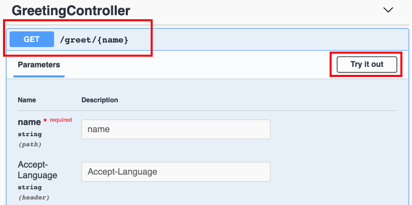

# Write scalable and extensible Node.js applications using LoopBack 4

## What is LoopBack?

[LoopBack](https://loopback.io/) is a popular open source API and Microservice framework 
in Node.js. Built on top of Express, it enables developers to quickly create REST and other forms of APIs or Microservices to interact with backend databases, services and other infrastructure using model driven design patterns. The command line tool makes the API creation easy and productive. 

Rewritten in TypeScript from ground-up, LoopBack 4 core offers an Inversion of Control container with powerful Dependency Injection capabilities as the foundation to build large-scale Node.js projects with great flexibility and extensibility. LoopBack also integrates with cloud native health, metrics, and tracing to facilitate development of Microservices for cloud deployment.

## About This Workshop

As your Node.js application becomes more complex, how do you increase its scalability with proven design patterns and best practices? How do you follow 12-factor principles to make your application flexible, extensible and composable? Let’s run a fun workshop to create a scalable and extensible application! While we could do this from scratch, we'll get there much faster and easier using a framework that does a lot of the hard work for us.

In this workshop, you will be guided to scaffold a greeter app using the LoopBack 4 framework, and create a simple greeting API that prints out a welcome message, then enrich it without modifying its implementation in the next 4 steps:

1. The greeting service is packaged as a separate module from the greeting app (modular)
2. The greeting API can speak different languages based on the client locale. The support for new languages can be plugged in (extensibility and pluggability)
3. Enable the caching with sweeping for REST requests (interception/observation)
4. The greeting app and certain greeters have configuration options (configurability) _FIXME: we don't have this part, right?_


This miniature project reflects many key aspects of a scalable and extensible applications, and relevant techniques will be covered in the workshop, like Inversion of Control, Dependency Injection, Decorators and Component.


## Before We Begin
To complete the steps in this tutorial, you need to install Node.js and the LoopBack 4 command line interface (CLI).

1. Install Node.js version 8.9 or higher. 
    See the [Node documentation](https://nodejs.org/en/download/) for installation instructions.
    
    Tip: We recommend to use [Node Version Manager (nvm)](https://github.com/nvm-sh/nvm) to make it easier to manage the Node.js versions you're using. 

2. Install LoopBack 4 CLI

    The LoopBack 4 CLI is a command-line interface that scaffolds an application as well as artifacts (for example, controllers, models, and repositories) for existing applications. The CLI provides the fastest and easiest way to get started with a LoopBack 4 project that adheres to best practices.

    Install the CLI globally by running the following command:

    ```sh
    npm i -g @loopback/cli
    ```

## Part 1: Create a Greeting Application

As the first step, we are going to create a greeting application that utilize the pre-existing LoopBack extension `greeter-extension`.

### Step 1: Create a Message Type File
We're going to create a `Message` type. This will be used as the response type that the GreetingService produces. In the `src` folder, create a file called `types.ts` with the following content:

```ts
/**
 * Greeting message response
 */
export interface Message {
  timestamp: Date;
  language: string;
  greeting: string;
}
```

### Step 2: Create a Greeting Controller

1. Create an endpoint `/greet/{name}` that takes a name and returns a greeting message in the language that is specified in the HTTP request. Run the Controller generator: 

    ```sh
    $ lb4 controller
    ? Controller class name: Greeting
    Controller Greeting will be created in src/controllers/greeting.controller.ts

    ? What kind of controller would you like to generate? Empty Controller
    create src/controllers/greeting.controller.ts
    update src/controllers/index.ts

    Controller Greeting was created in src/controllers/
    ```

2. In the generated GreetingController in `src/controllers/greeting.controller.ts`, modify the constructor:
    ```ts
    constructor(
        @inject(GREETING_SERVICE) private greetingService: GreetingService,
        @inject(RestBindings.Http.REQUEST) private request: Request,
    ) {}
    ```

3. Add the endpoint `/greet/{name}` which calls the [GreetingService](https://github.com/strongloop/loopback-next/blob/master/examples/greeter-extension/src/greeting-service.ts) in the greeter-extension that we've created already. It accepts language English or Chinese. If other language is specified, it will fall back to English.

    ```ts
    @get('/greet/{name}', {
    responses: {
    '200': {
        description: '',
        content: {
        'application/json': {
            schema: {
            type: 'object',
            properties: {
                timestamp: 'string',
                language: 'string',
                message: 'string',
            },
            },
        },
        },
    },
    },
    })
    async greet(
        @param.path.string('name') name: string,
        @param.header.string('language') lan: string,
    ): Promise<Message> {
        const language: string =
        this.request.acceptsLanguages(['en', 'zh']) || 'en';
        const greeting = await this.greetingService.greet(language, name);
        return {
        timestamp: new Date(),
        language,
        greeting,
        };
    }
    ```
4. Add the necessary imports

    ```ts
    import { param, get, Request, RestBindings } from "@loopback/rest";
    import { Message } from "../types";
    import {inject} from '@loopback/context';
    import {
        GreetingService,
        GREETING_SERVICE,
    } from '@loopback/example-greeter-extension';
    ```

5. Make sure we install the extension: 
    ```sh
    npm i --save @loopback/example-greeter-extension
    ```

### Step 3: Bind the GreetingService to the application

Under `src/application.ts`, add the following line inside the constructor:
```ts
    this.component(RestExplorerComponent);

    // add this line
    this.component(GreetingComponent);

    this.projectRoot = __dirname;
```

### Step 4: Try it Out!
Let’s try out our application! First, you’ll want to start the app.

```sh
$ npm start
Server is running at http://[::1]:3000
Try http://[::1]:3000/ping
```

Next, go to the [API Explorer](http://localhost:3000/explorer), you should see the `GreetingController` section as shown in the screen shot below.  Then click "Try it out". 



#### Test 1: Set the Language to English `en`
Type in a name for the `name` field and `en` for the `language` field to indicate we're testing it using English. Then click Execute. 

Under the Responses section, you should be able to see the response code being `200` and a response body similar to below:
```json
{
  "timestamp": "2019-09-25T20:16:37.378Z",
  "language": "en",
  "greeting": "Hello, Diana!"
}
```

#### Test 2: Set the Language to Chinese `zh`
Now, change the `language` field to `zh` so that we'll setting the language as Chinese. 

Click Execute, and you'll get a response similar to below:
```json
{
  "timestamp": "2019-10-01T18:17:07.730Z",
  "language": "zh",
  "greeting": "Diana，你好！"
}
```


#### Test 3: Set the Language to French `fr`
Let's try it one more time with language `fr`.  Since there is no greeter for French, so it will fall back to use English.  The response will be as follows:
```json
{
  "timestamp": "2019-10-01T18:26:45.742Z",
  "language": "fr",
  "greeting": "Hello, Diana!"
}
```


## Part 2: Add a French Greeter  
_TODO: what it actually does? Add on the extension?_

Now, we're going to create a French greeter. 


### Step 1: Creater French Greeter
1. In `src` folder, create a file called `greeter-fr.ts`. 
2. Add the `FrenchGreeter` class. 

    ```ts
    /**
     * A greeter implementation for French.
     */
    @bind(asGreeter)
    export class FrenchGreeter implements Greeter {
    language = 'fr';

    constructor(
        /**
         * Inject the configuration for FrenchGreeter
         */
        @config()
        private options: FrenchGreeterOptions = {nameFirst: true},
    ) {}

    greet(name: string) {
        if (this.options && this.options.nameFirst === false) {
        return `Bonjour，${name}！`;
        }
        return `${name}, Bonjour`;
    }
    }
    ```
2. Add the `FrenchGreeterOptions` interface.

    ```ts
    /**
     * Options for the Frech greeter
     */
    export interface FrenchGreeterOptions {
        // Name first, default to `true`
        nameFirst: boolean;
    }
    ```

3. Add the required imports.
    ```ts
    import {bind, config} from '@loopback/context';
    import {asGreeter, Greeter} from '@loopback/example-greeter-extension';
    ```

### Step 2: Bind the FrenchGreeter in the Application

In `src/application.ts`, inside the constructor, add the line below: 
```ts
 this.component(GreetingComponent);
 // add this line 
 this.add(createBindingFromClass(FrenchGreeter));
```

Add the following import statements:
```ts
import {ApplicationConfig, createBindingFromClass} from '@loopback/core'; //Change this line
import {FrenchGreeter} from './greeter-fr'; //Add this line
```

### Step 3: Try Out the New Greeter
Let's try out the new French Greeter.  
1. Stop the application by entering Ctrl+C.
2. Restart the application again by running `npm start`. 
3. Go to API Explorer, http://localhost:3000/explorer.
4. Under the `GET /greet/{name}` endpoint, enter `fr` as the language as shown below. 

    

5. In the response body section, you should be able to see the greeting in French.
    ```json
    {
    "timestamp": "2019-10-01T18:47:37.096Z",
    "language": "fr",
    "greeting": "Diana, Bonjour"
    }
    ```


## Part 3: Enable Caching

_TODO: what we want to do in this part_ 

### Step 1: Create a caching service

1. Assuming this caching service is ready to use, we'll just copy and paste `src/services/caching.service.ts`.

2. Create the binding key for caching service. 
_TODO: explain why._

    In `src` folder, create a file called `keys.ts` with the following content:

    ```ts
    import {BindingKey} from '@loopback/context';
    import {CachingService} from './services/caching.service';

    /**
     * Strongly-typed binding key for CachingService
     */
    export const CACHING_SERVICE = BindingKey.create<CachingService>(
    'services.CachingService',
    );
    ```


### Step 2: Create the observer

We'd like to start the caching service during the start of the application.  Likewise, we'd also want to stop the caching service when the application stops.  To do this, we are going to use a [lifecycle observer](https://loopback.io/doc/en/lb4/Life-cycle.html).  


1. Run the observer generator `lb4 observer` command.
    ```sh
    $ lb4 observer
    ? Observer name: Cache
    ? Observer group: 
    create src/observers/cache.observer.ts
    update src/observers/index.ts

    Observer Cache was created in src/observers/
    ```

2. Go to `src/observers/cache.observer.ts`, modify the constructor to get the caching service: 

    ```ts
    constructor(
        @inject(CACHING_SERVICE) private cachingService: CachingService,
    ) {}
    ```

    And the following import statements:

    ```ts
    import {inject} from '@loopback/context';
    import {CachingService} from '../services/caching.service';
    import {CACHING_SERVICE} from '../keys';
    ```

3. For the `start()` and `stop()` function, we want to start and stop the caching service.

    ```ts
    /**
     * This method will be invoked when the application starts
     */
    async start(): Promise<void> {
        // Add your logic for start
        await this.cachingService.start();
    }

    /**
     * This method will be invoked when the application stops
     */
    async stop(): Promise<void> {
        // Add your logic for stop
        await this.cachingService.stop();
    }
    ```


### Step 3: Create global interceptor for caching

1. Run the interceptor generator `lb4 interceptor` command.

    ```sh
    $ lb4 interceptor
    ? Interceptor name: caching
    ? Is it a global interceptor? Yes

    Global interceptors are sorted by the order of an array of group names bound to ContextBindings.GLOBAL_INTERCEPTOR_ORDERED_GROUPS. See https://loopback.io/doc/en/lb4/Interceptors.html#order-of-invocation-for-interceptors.

    ? Group name for the global interceptor: ('') 
    create src/interceptors/caching.interceptor.ts
    update src/interceptors/index.ts

    Interceptor Caching was created in src/interceptors/
    ```

2. In `src/interceptors/caching.interceptors.ts`, modify the constructor:

    ```ts
    constructor(
        @inject(CACHING_SERVICE) private cachingService: CachingService,
    ) {}
    ```

    Add and modify the following import statements:

    ```ts
    import {
        /* inject, */
        globalInterceptor,
        Interceptor,
        InvocationContext,
        InvocationResult,
        Provider,
        inject,
        ValueOrPromise,
    } from '@loopback/context';
    import {CachingService} from '../services/caching.service';
    import {CACHING_SERVICE} from '../keys';
    import {RestBindings} from '@loopback/rest';
    ```

3. Add the pre-invocation and post-invocation logics in the `intercept` function.

    ```ts
    // Add pre-invocation logic here
    const httpReq = await invocationCtx.get(RestBindings.Http.REQUEST, {
        optional: true,
    });
    /* istanbul ignore if */
    if (!httpReq) {
        // Not http request
        return next();
    }
    const key = httpReq.path;
    const lang = httpReq.acceptsLanguages(['en', 'zh']) || 'en';
    const cachingKey = `${lang}:${key}`;
    const cachedResult = await this.cachingService.get(cachingKey);
    if (cachedResult) {
        console.error('Cache found for %s %j', cachingKey, cachedResult);
        return cachedResult;
    }

    const result = await next();

    // Add post-invocation logic here
    await this.cachingService.set(cachingKey, result);
    return result;
    ```

### Step 4: Try it out again! 

Restart your application. 

_TODO: how to test caching is working?_


## Conclusion 

Congratulations! You have completed the tutorial. 

You have successfully built a LoopBack application using an existing extension `greeter-extension`, and then you have added functionality on top of the existing extension, i.e. add a French greeter.  Lastly, you have enabled caching as part of the application lifecycle.


## Authors 
- [Diana Lau](https://github.com/dhmlau)
- [Janny Hou](https://github.com/jannyhou)
- [Dominique Edmond](https://github.com/emonddr)
- [Agnes Lin](https://github.com/agnes512)


## References

- LoopBack documentation, https://loopback.io/doc/en/lb4/
- StrongLoop blog, https://strongloop.com/strongblog/
- LoopBack 4 GitHub repo, https://github.com/strongloop/loopback-next


## Stay in Touch

- [Twitter @StrongLoop](https://twitter.com/strongloop)
- [LinkedIn StrongLoop Developer Community Group](https://www.linkedin.com/groups/5046525)
- [Facebook @Strongloop](https://www.facebook.com/strongloop/)


[-@2x.png)](http://loopback.io/)
